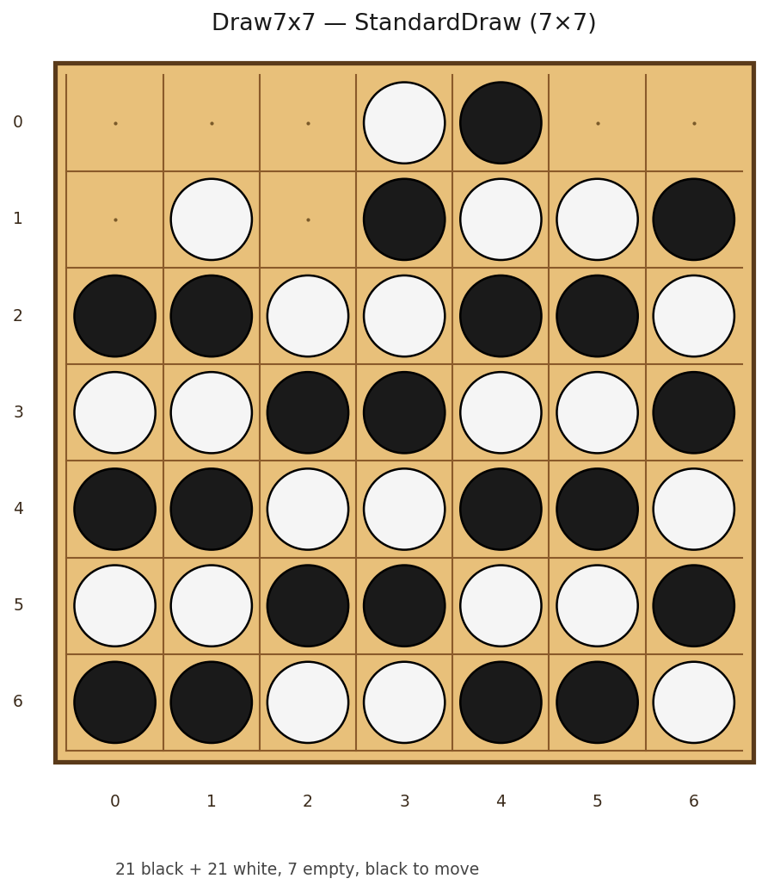
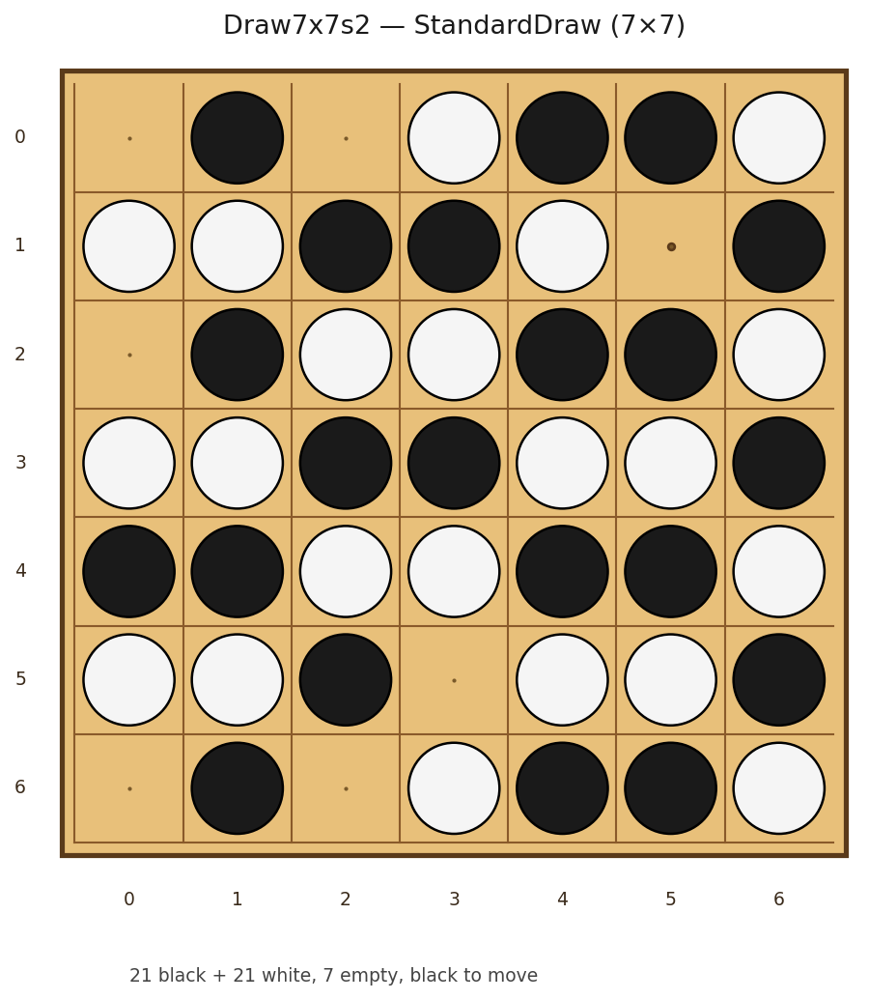
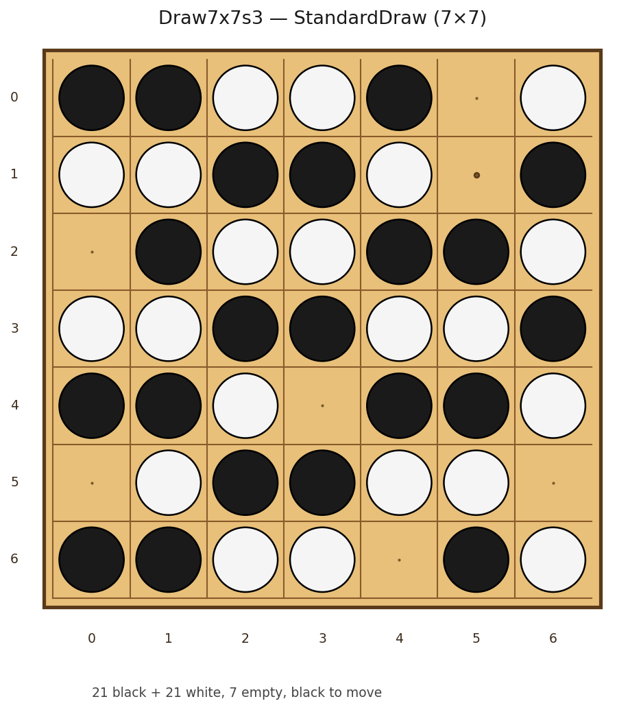
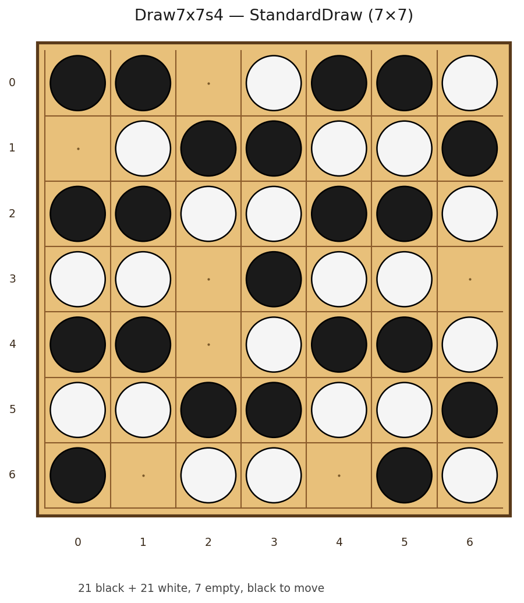
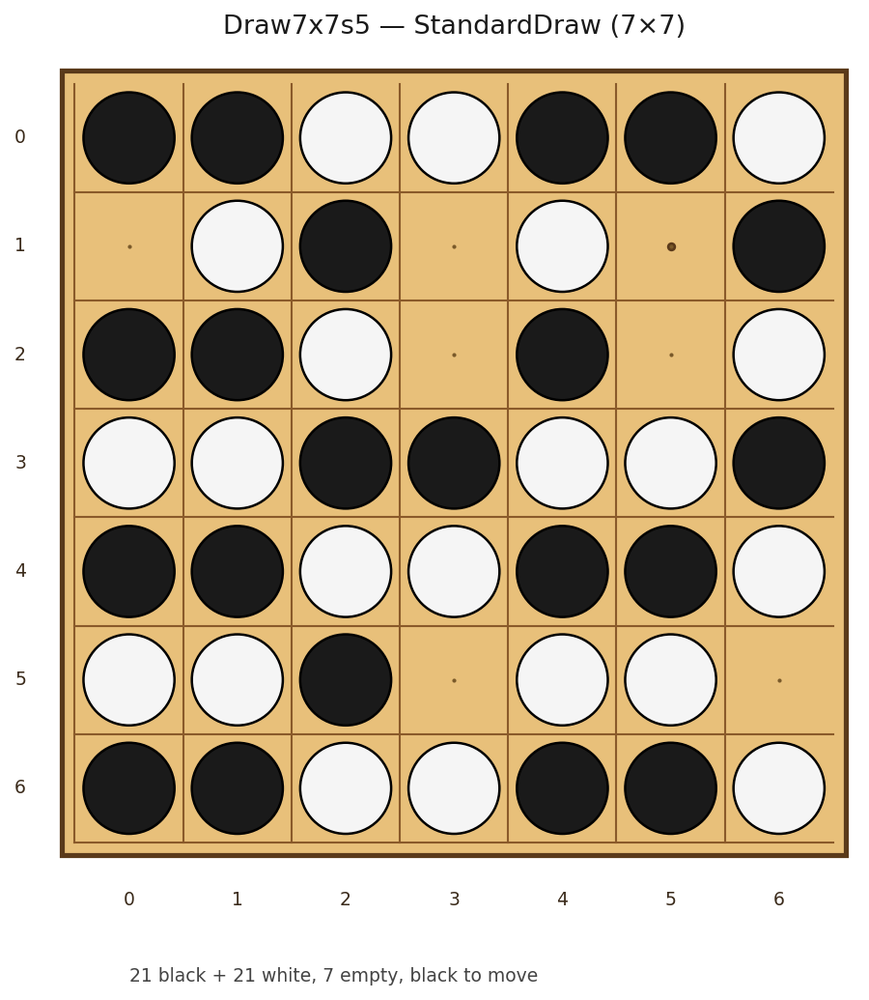
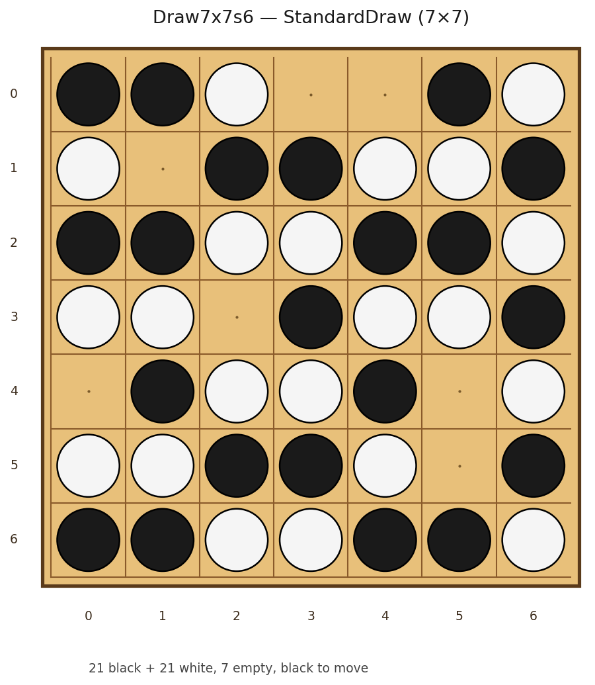
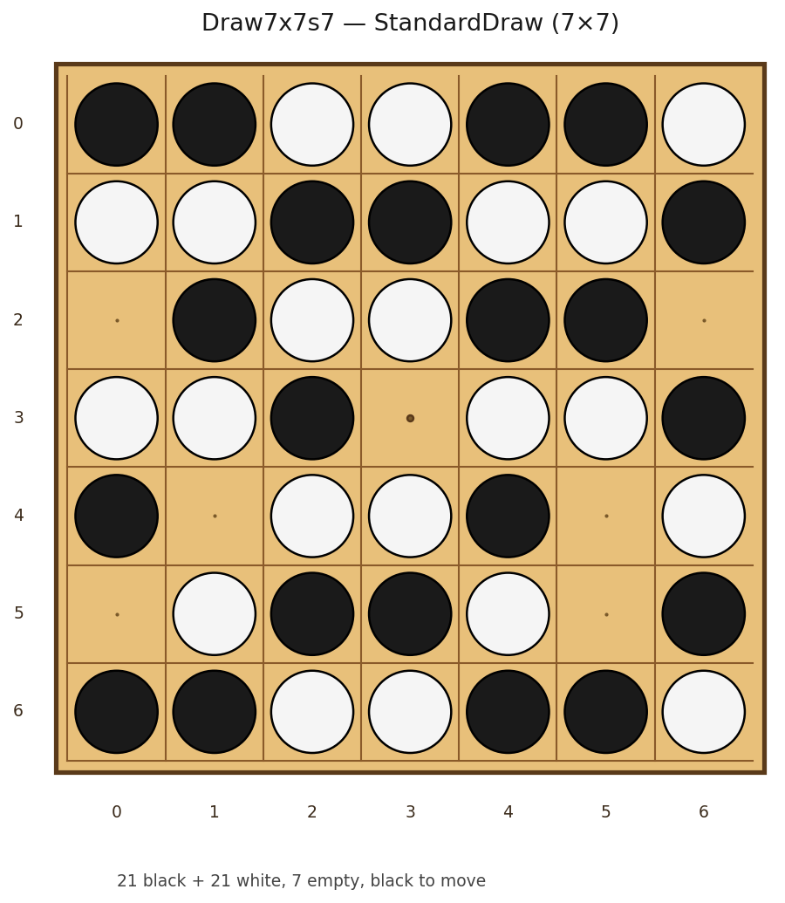
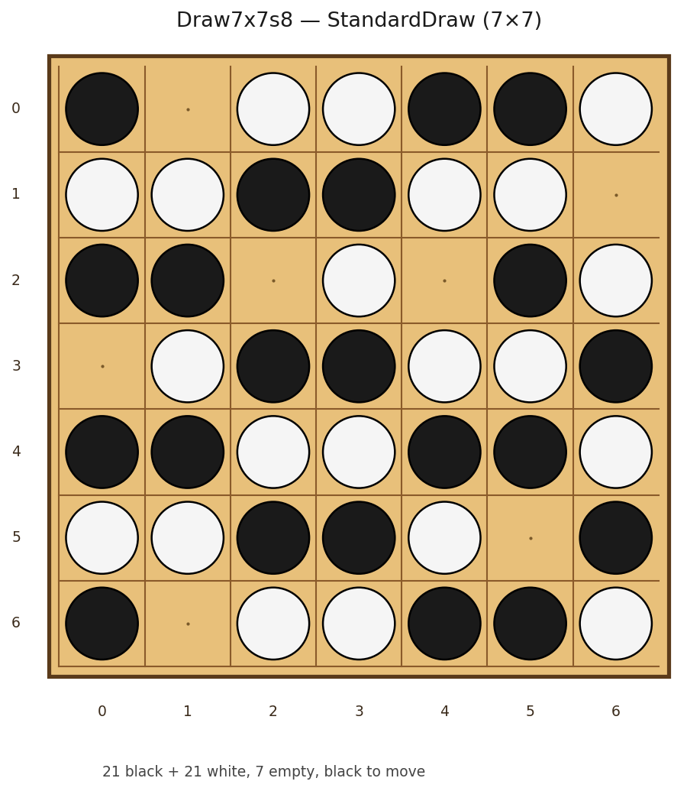
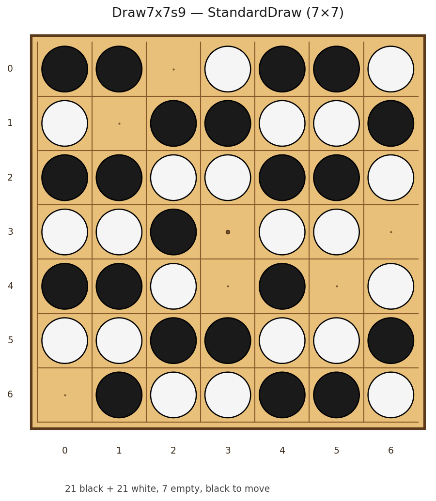

# 7×7 和棋局面图集 (Draw Gallery)

下列 9 个局面均已在 Lean 中机器验证 `StandardDraw`(每个长度 5 窗口
同时含黑子和白子,任何一方都无法成五;两侧防守证书由 C++ 搜索生成,
Lean 检查器验证后组合出和棋)。

| 定理 | 局面 | 黑 | 白 | 空 | 轮到 |
|---|---|---|---|---|---|
| `Draw7x7.lean` | seed 1 (original) | 21 | 21 | 7 | black |
| `Draw7x7s2.lean` | seed 2 | 21 | 21 | 7 | black |
| `Draw7x7s3.lean` | seed 3 | 21 | 21 | 7 | black |
| `Draw7x7s4.lean` | seed 4 | 21 | 21 | 7 | black |
| `Draw7x7s5.lean` | seed 5 | 21 | 21 | 7 | black |
| `Draw7x7s6.lean` | seed 6 | 21 | 21 | 7 | black |
| `Draw7x7s7.lean` | seed 7 | 21 | 21 | 7 | black |
| `Draw7x7s8.lean` | seed 8 | 21 | 21 | 7 | black |
| `Draw7x7s9.lean` | seed 9 | 21 | 21 | 7 | black |

## Draw7x7 (seed 1 (original))

`StandardDraw <Draw7x7 根局面>` — 21 黑 + 21 白, 7 空, black 走。



```text
      x=0 1 2 3 4 5 6
  y=0   · · · W B · ·
  y=1   · W · B W W B
  y=2   B B W W B B W
  y=3   W W B B W W B
  y=4   B B W W B B W
  y=5   W W B B W W B
  y=6   B B W W B B W
```

## Draw7x7s2 (seed 2)

`StandardDraw <Draw7x7s2 根局面>` — 21 黑 + 21 白, 7 空, black 走。



```text
      x=0 1 2 3 4 5 6
  y=0   · B · W B B W
  y=1   W W B B W · B
  y=2   · B W W B B W
  y=3   W W B B W W B
  y=4   B B W W B B W
  y=5   W W B · W W B
  y=6   · B · W B B W
```

## Draw7x7s3 (seed 3)

`StandardDraw <Draw7x7s3 根局面>` — 21 黑 + 21 白, 7 空, black 走。



```text
      x=0 1 2 3 4 5 6
  y=0   B B W W B · W
  y=1   W W B B W · B
  y=2   · B W W B B W
  y=3   W W B B W W B
  y=4   B B W · B B W
  y=5   · W B B W W ·
  y=6   B B W W · B W
```

## Draw7x7s4 (seed 4)

`StandardDraw <Draw7x7s4 根局面>` — 21 黑 + 21 白, 7 空, black 走。



```text
      x=0 1 2 3 4 5 6
  y=0   B B · W B B W
  y=1   · W B B W W B
  y=2   B B W W B B W
  y=3   W W · B W W ·
  y=4   B B · W B B W
  y=5   W W B B W W B
  y=6   B · W W · B W
```

## Draw7x7s5 (seed 5)

`StandardDraw <Draw7x7s5 根局面>` — 21 黑 + 21 白, 7 空, black 走。



```text
      x=0 1 2 3 4 5 6
  y=0   B B W W B B W
  y=1   · W B · W · B
  y=2   B B W · B · W
  y=3   W W B B W W B
  y=4   B B W W B B W
  y=5   W W B · W W ·
  y=6   B B W W B B W
```

## Draw7x7s6 (seed 6)

`StandardDraw <Draw7x7s6 根局面>` — 21 黑 + 21 白, 7 空, black 走。



```text
      x=0 1 2 3 4 5 6
  y=0   B B W · · B W
  y=1   W · B B W W B
  y=2   B B W W B B W
  y=3   W W · B W W B
  y=4   · B W W B · W
  y=5   W W B B W · B
  y=6   B B W W B B W
```

## Draw7x7s7 (seed 7)

`StandardDraw <Draw7x7s7 根局面>` — 21 黑 + 21 白, 7 空, black 走。



```text
      x=0 1 2 3 4 5 6
  y=0   B B W W B B W
  y=1   W W B B W W B
  y=2   · B W W B B ·
  y=3   W W B · W W B
  y=4   B · W W B · W
  y=5   · W B B W · B
  y=6   B B W W B B W
```

## Draw7x7s8 (seed 8)

`StandardDraw <Draw7x7s8 根局面>` — 21 黑 + 21 白, 7 空, black 走。



```text
      x=0 1 2 3 4 5 6
  y=0   B · W W B B W
  y=1   W W B B W W ·
  y=2   B B · W · B W
  y=3   · W B B W W B
  y=4   B B W W B B W
  y=5   W W B B W · B
  y=6   B · W W B B W
```

## Draw7x7s9 (seed 9)

`StandardDraw <Draw7x7s9 根局面>` — 21 黑 + 21 白, 7 空, black 走。



```text
      x=0 1 2 3 4 5 6
  y=0   B B · W B B W
  y=1   W · B B W W B
  y=2   B B W W B B W
  y=3   W W B · W W ·
  y=4   B B W · B · W
  y=5   W W B B W W B
  y=6   · B W W B B W
```
